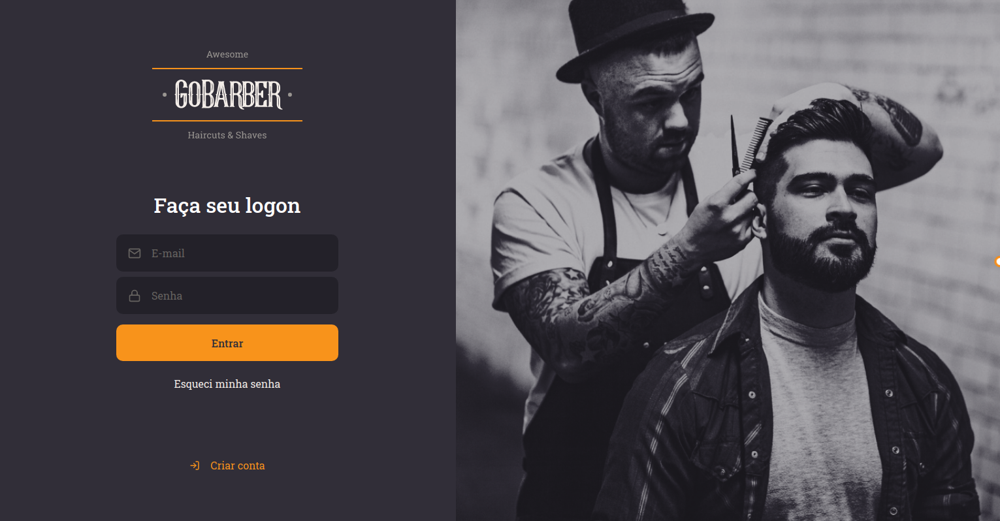
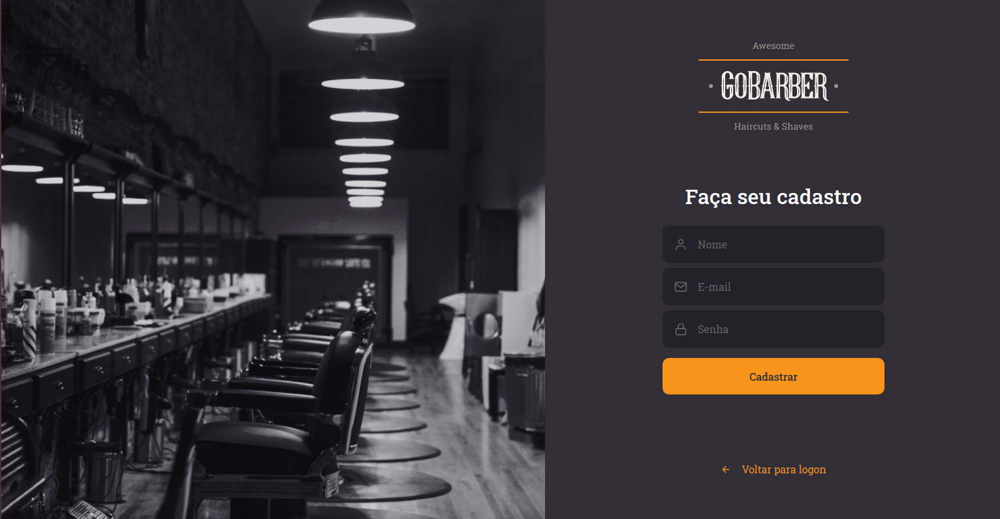
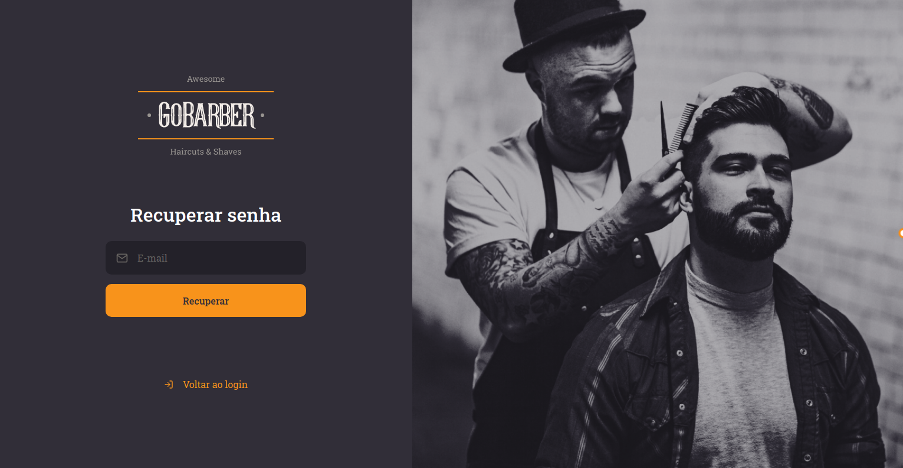
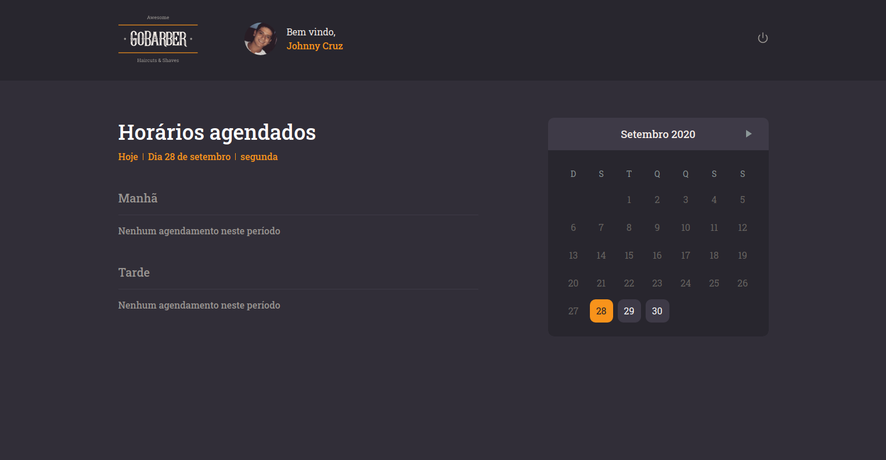
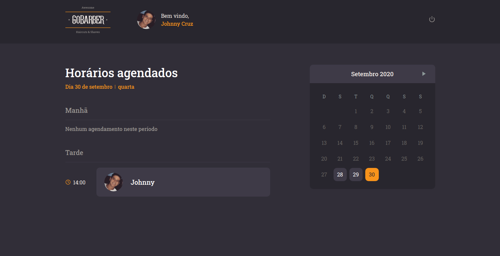
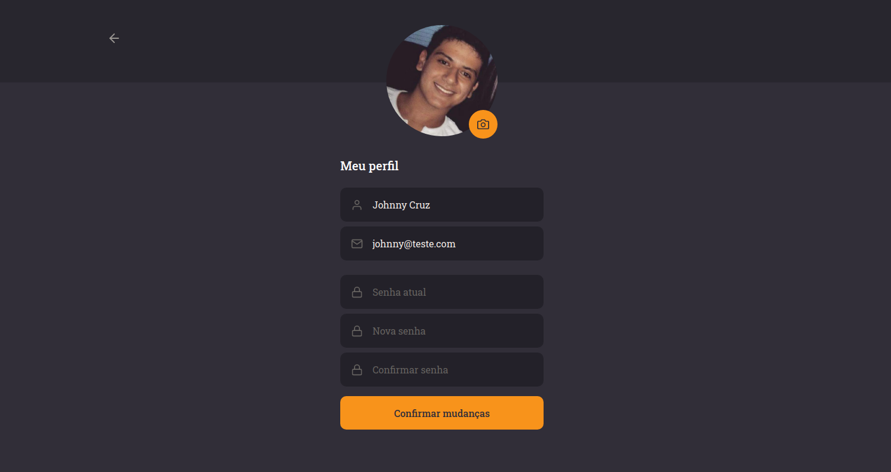

## GoBarber - Nova Jornada GoStack 🚀️

### Sobre o Projeto

GoBarber é uma aplicação para agendar e gerenciar serviços de beleza, onde prestadores de serviços podem se cadastrar, e usuários poderão marcar agendamentos com estes provedores.

Tecnologias usadas:

-   [ReactJS](https://reactjs.org/)
-   [TypeScript](https://github.com/microsoft/TypeScript)
-   [React-icons](https://react-icons.netlify.com/)
-   [Axios](https://github.com/axios/axios)
-   [Styled Components](https://styled-components.com/)
{...}

Telas da aplicação:

-  Web:

    
    
    
    
    
    

